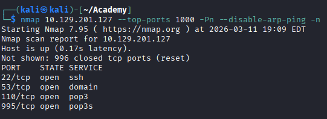

# Attacking Common Services - Medium

From internal conversations, we heard that this is used relatively rarely and, in most cases, has only been used for testing purposes so far. It is required to asses de target server and find the falg.txt file.

Start scannig the target with nmap.

<figure><figcaption></figcaption></figure>

Below the dedicated scanning for each services recognize

<figure><figcaption></figcaption></figure>

<figure><figcaption></figcaption></figure>

<figure><figcaption></figcaption></figure>

<figure><figcaption></figcaption></figure>

<figure><figcaption></figcaption></figure>

Try to see if there is a DNS zone transfer with dig tool

<figure><figcaption></figcaption></figure>

Trying to get some more information in the target with the information gatered until now, i did not find something interesting. So i decided to make a another complete scan.

<figure><figcaption></figcaption></figure>

We can see that there are two services that we did not  take account before. So, let's try to access in both server, in the 2121 i did not find anything with anonymous login, and in the 30021 the next results were found: 

<figure><figcaption></figcaption></figure>

So I could access to the share:

<figure><figcaption></figcaption></figure>

<figure><figcaption></figcaption></figure>

Interesting, this probably are credentials for another service, that we could leverage, maybe the same ftp service:

<figure><figcaption></figcaption></figure>

And trying to access with these credetentials:

<figure><figcaption></figcaption></figure>

Content of flag.txt:

<figure><figcaption></figcaption></figure>

> Answer: 1qay2wsx3EDC4rfv\_M3D1UM

Yeei!
