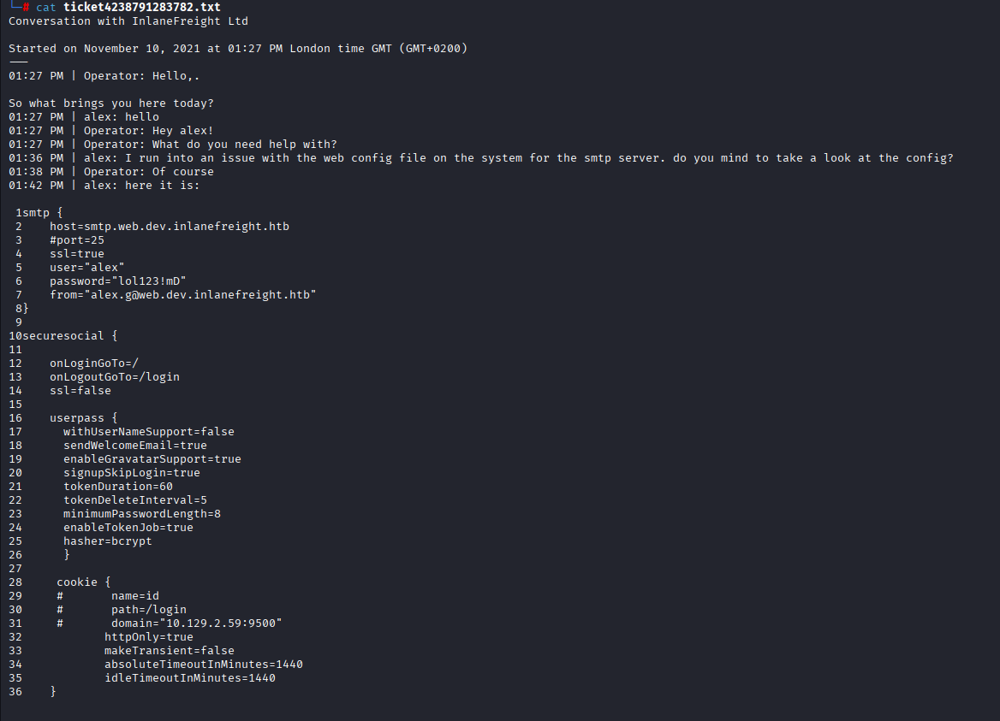

# Footprinting Lab - Medium

To begin we can gather the following information provided to us:

* User named HTB has been created.
* We need to obtain the credentials of this user as proof.
* We have to analyze a new service

Let's start for scann all the ports in the machine:

<figure><figcaption></figcaption></figure>

So, we can see that a well-known port promt to us when we make a scan, its the 2049: NFS - its purpose is to access file systems over a network as if they were local.

So in the gather of knowledge of this service we found the next one:

In the gather of knowledge of this service we found the next one: The NFS protocol has no mechanism for authentication or authorization. Instead, authentication is completely shifted to the RPC protocol's options. Rpc protocol fall on 111 tcp port, and actually we see it.&#x20;

Now, dive into the functionality of these services. Based in this [article](https://www.techtarget.com/searchapparchitecture/definition/Remote-Procedure-Call-RPC). It is a procedure that allow a program call a external funcition (function in another computer) like a internal funcition trough a framework. Based on the nfs functionality, we can see how they are related to.

when we try to interact with the rpc server we got this:

<figure><figcaption></figcaption></figure>

And when we mount with the following commands:

```zsh
Valemiliano@htb[/htb]$ mkdir target-NFS
Valemiliano@htb[/htb]$ sudo mount -t nfs 10.129.14.128:/ ./target-NFS/ -o nolock
Valemiliano@htb[/htb]$ cd target-NFS
Valemiliano@htb[/htb]$ tree .
```

we can see this:

<figure><figcaption></figcaption></figure>

And when we check the only file that seems to have information by its size, we can look at the following log:

<figure><figcaption></figcaption></figure>

we obtained a bunch of interesting information by this log:

Host: smtp.web.dev.inlanefreight.htb

port=25

USER: alex

password: lol123!mD

from="alex.g@web.dev.inlanefreight.htb"

And some extra information about smtp server config file. Just in case, i decide to scan the ports that in our initial scann appear like unknown:

<figure><figcaption></figcaption></figure>

